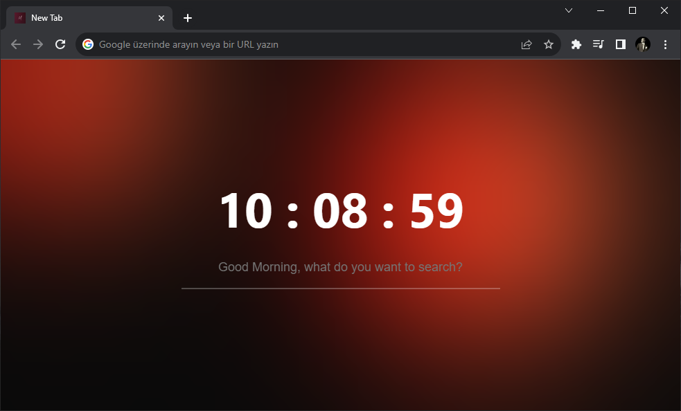
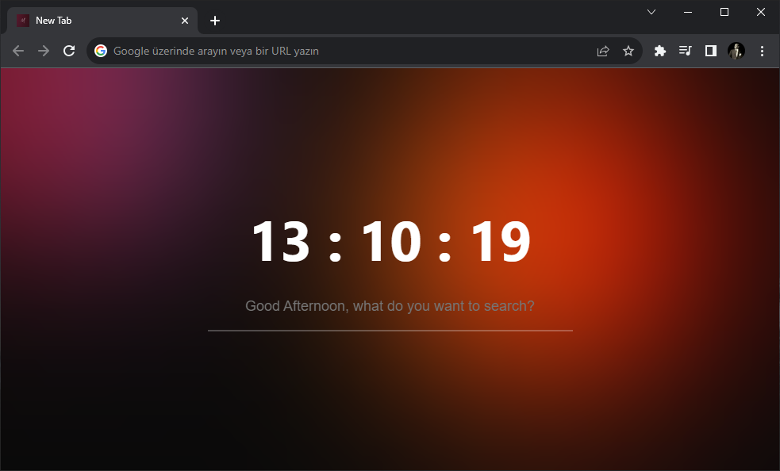
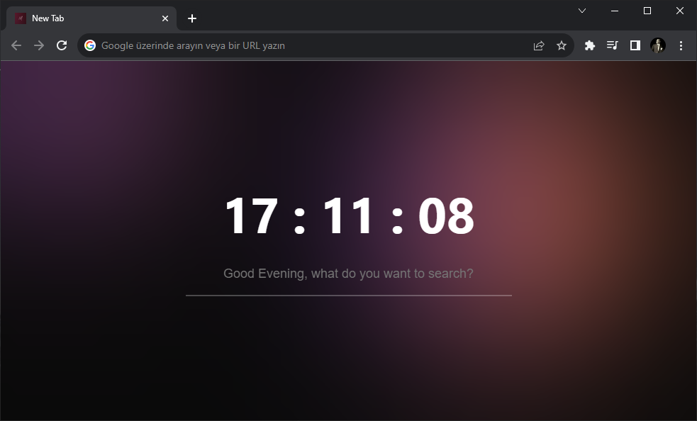
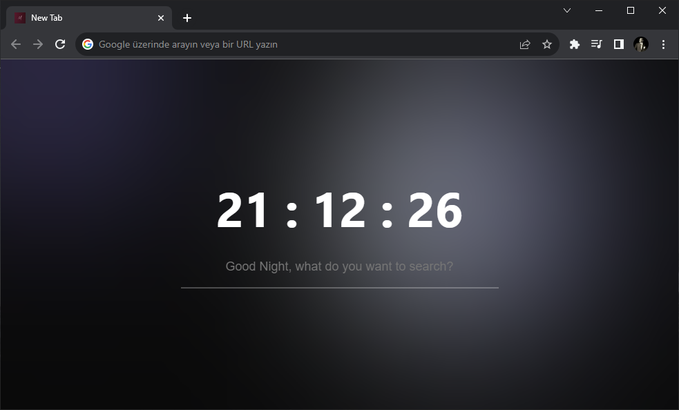

    

<h1 align= "center">minimalTab</h1>

Experience a minimalist Google homepage with a touch of colored lights

    
    
    
    

## Installation

* Download and extract the zip
* Then go to [chrome://extensions/](chrome://extensions/)
* Enable Developer Mode and click the **Load Unpacked Extension** button in the top left
* Upload the folder